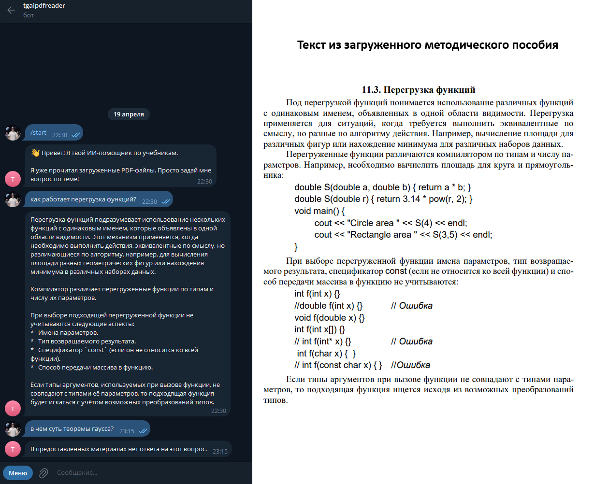

# tgaipdfreader
Телеграм бот, который c помощью Gemini 2.5-flash отвечает на вопросы опираясь на материалы загруженные в формате pdf

Чтобы добавить материалы нужно поместить pdf в папку books, затем обработать файлы утилитой ingest.py
(В папке examples есть пример pdf и готового storage. Чтобы сразу протестировать проект без запуска ingest.py, содержимое storage_example нужно поместить в папку storage в корне проекта. В таком случае бот будет опираться на Navrockij_Osnovy.pdf)

steps for git bash
1. [cmd] python -m venv venv
2. [cmd] source venv/Scripts/activate
3. [cmd] pip install -r requirements.txt
4. copy pdf to /books/
5. [cmd] python ingest.py
6. create .env file, insert text from env.example and api keys
7. [cmd] python bot.py

